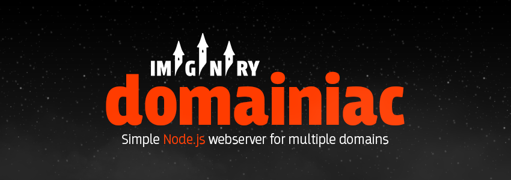
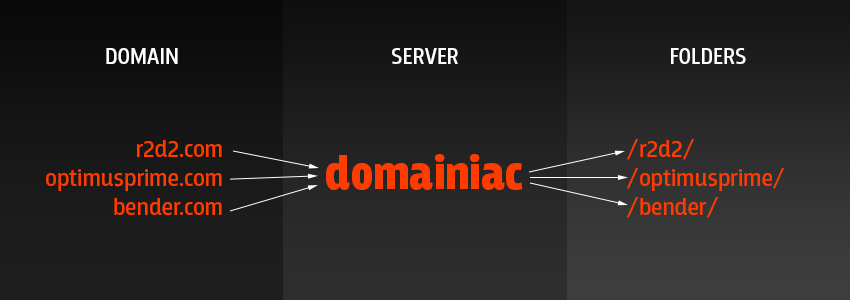

##Description
A very simple and user friendly webserver with easy domain to directory routing for Node.js. 

No need to require domainiac in your code since this runs as a command line tool (CLI).
Domainiac serves only static content without custom alterations.




##How to use

Install it through the Node Package Manager:

`$ npm install domainiac -g`

Note that it should be installed globally to be able to run it from any folder.

Then start `$ domainiac` from preferred folder.
This automatically creates the file settings.json in that folder that looks like this:

```json
{
    "port": 5555,
    "routes": {
        "foo.com": "/foo",
        "bar.com": "/bar"
    }
}
```

Edit **settings.json** and then run `$ domainiac` again to get it running.

If you want to run domainiac using the node module [forever](https://www.npmjs.org/package/forever "A simple CLI tool for ensuring that a given node script runs continuously") you'll have to specify the complete location in order to make it work, as it doesn't support sumbolic links:

`$ forever start /usr/local/lib/node_modules/domainiac/index.js`

Authors
-------
[IMGNRY](http://imgnry.com "IMGNRY")  
[Fille Åström](https://twitter.com/bobmoff "@bobmoff")  
[Kristofer Guldvarg](https://twitter.com/guldvarg "@guldvarg")

